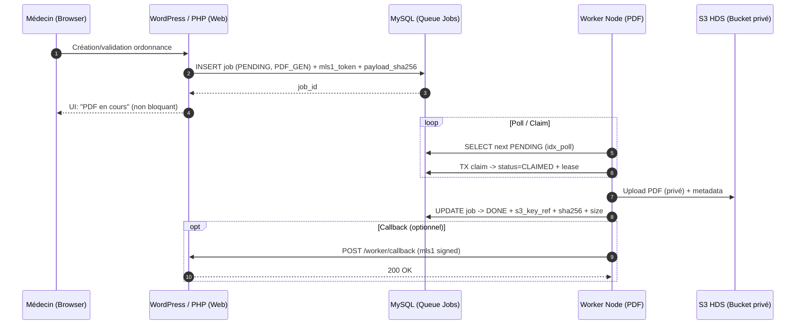
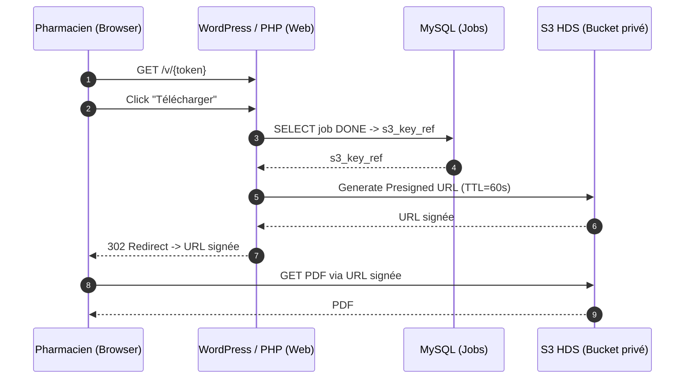
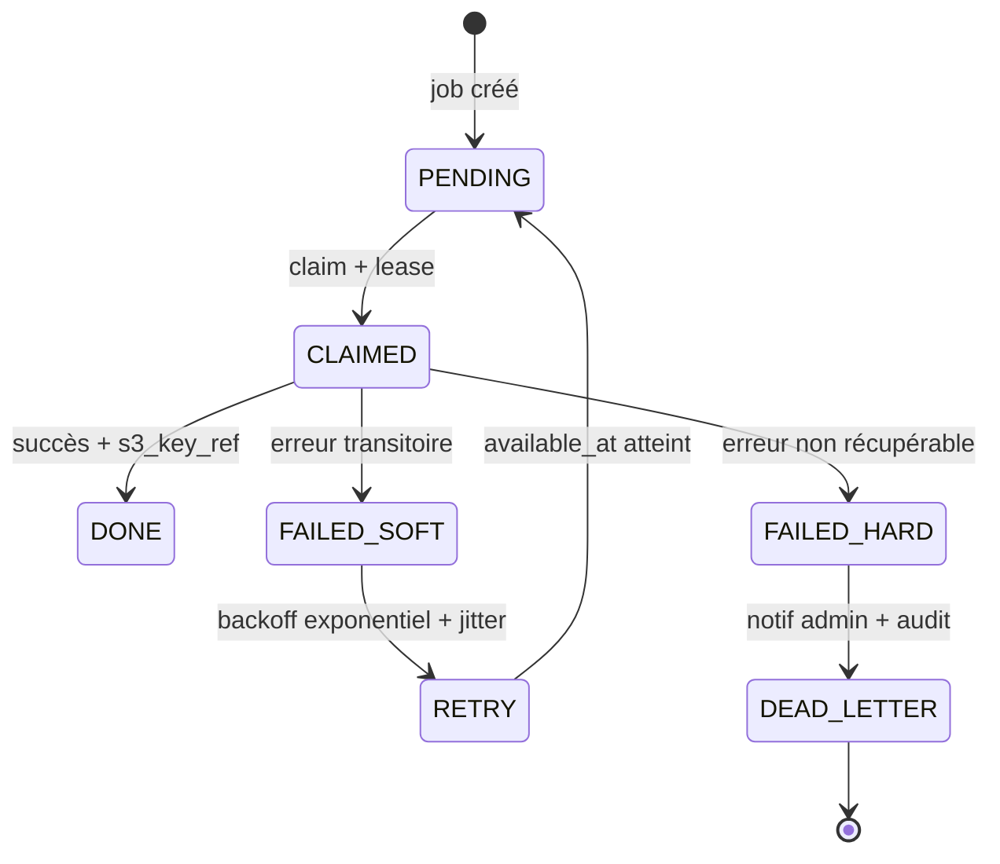

# SOS Prescription v3 — Bible Technique (Master Technical Specification / Dossier d’Architecture Complet)
**Status**: SSOT — Normatif (Architecture & Sécurité)  
**Date**: 2026-03-10  
**Audience**: Architectes Cloud (HDS), SRE, Backend Engineers (PHP/Node), Sécurité, Compliance  
**Plateforme cible**: Scalingo HDS (PaaS) — Architecture distribuée *MedLab Unit* (WP Web) + *MedLab Runtime* (Node Worker)  
**Règle d’écriture**: *Aucun code source applicatif* — uniquement schémas (SQL DDL, JSON Schema, Mermaid).

---

## Sommaire
0. [Vision & Doctrine](#0-vision--doctrine)  
1. [Infrastructure & Scaling](#1-infrastructure--scaling)  
2. [Sécurité & Umbilical Cord](#2-sécurité--umbilical-cord)  
3. [Architecture de Données](#3-architecture-de-données)  
4. [Workflows Métiers](#4-workflows-métiers)  
5. [Observabilité & Support](#5-observabilité--support)  
6. [Résilience & Airbags](#6-résilience--airbags)  
7. [Stratégie de Migration (Lazy Migration)](#7-stratégie-de-migration-lazy-migration)  

---

## 0. Vision & Doctrine

### 0.1 Vision (v3)
SOS Prescription v3 transforme un plugin WordPress monolithique (v2) en une **MedLab Unit** conforme au standard 2026, opérant sur une infrastructure **Scalingo HDS**.

La v3 adopte une architecture distribuée :
- **Web (PHP/WordPress)** : UX, parcours patient/médecin/pharmacien, contrôle d’accès, création des jobs, génération d’URLs signées S3.
- **Worker (Node.js 24)** : exécution asynchrone des tâches lourdes (PDF), archivage batch des logs, endpoint /pulse.

### 0.2 Doctrine “Stateless”
**Principe** : *aucun état durable sur le filesystem applicatif*.

- Le filesystem Scalingo est considéré **éphémère**.
- Seuls les usages **temporaires** (scratch) sont autorisés en `/tmp` (fichiers temporaires, buffers).
- L’état durable est **externalisé** :
  - **MySQL** : données structurées + queue durable (jobs)
  - **S3 HDS** : PDF et archives logs

**Interdit** :
- Stocker durablement des PDF ou des logs dans `wp-content/uploads/` en production v3.
- Assumer l’existence d’un cache disque durable.

### 0.3 Doctrine “Diesel-Grade”
**Objectif** : robustesse, prédictibilité, reprise après crash, et simplicité d’exploitation.

Choix structurants :
- **Queue MySQL transactionnelle** (ACID) avec leasing (`locked_at` / `lock_expires_at`) plutôt qu’un système plus rapide mais “optionnel” (Redis).
- **Idempotence** et déduplication (hash payload + clés uniques).
- **Admission control** (protection mémoire) et limitation de concurrence sur les jobs lourds.

### 0.4 Doctrine “Nuclear Submarine”
**Objectif** : la mission continue, même en environnement hostile.

- **Hermeticity** : une panne du Worker ne doit pas “casser” WordPress.
- **Degraded mode** : l’UX doit informer sans bloquer la prescription.
- **Stealth** : journalisation structurée, anti-PII, pas de fuite d’artefacts ou de secrets.
- **Containment** : erreurs normalisées, pas de propagation “500” côté utilisateur final.

### 0.5 SSOT & invariants non négociables
- **HDS end-to-end** : aucun composant non-HDS ne doit héberger ou recevoir des données de santé (PDF, logs sensibles).
- **Umbilical Cord mls1** : toute communication inter-process est signée HMAC-SHA256 (raw bytes) et protégée contre le replay.
- **NDJSON** : logs *strictement* structurés, 1 ligne = 1 JSON.
- **ReqID** : corrélation support et incident sur toute la chaîne Web → Worker → S3.

---

## 1. Infrastructure & Scaling

### 1.1 Déploiement Scalingo HDS (Process Model)
L’application est déployée comme **une unité Scalingo** contenant **deux types de process** :
- `web` : WordPress/PHP (trafic HTTP)
- `worker` : Node.js (jobs asynchrones + /pulse)

**Contrat Procfile (conceptuel)** :
| Process type | Rôle | Durée de vie | Criticité |
|---|---|---:|---:|
| `web` | servir l’UI et les APIs, écrire en DB, presigner S3 | long-running | critique |
| `worker` | poll/claim jobs, générer PDF, uploader S3, archive logs, /pulse | long-running | critique pour PDF |

### 1.2 Filesystem éphémère : règles runtime
- `/tmp` : seul répertoire autorisé pour scratch (PDF intermediate).
- Toute sortie durable (PDF, logs archives) est externalisée sur S3 HDS.
- Toute configuration sensible (secrets HMAC, S3 creds) est injectée via **variables d’environnement** (secrets).

### 1.2.1 Runtime de production validé
- Runtime Worker: **Node.js 24**.
- Génération PDF: **Puppeteer + Chrome (buildpack dédié)**.
- **mPDF est abandonné en v3** et n’est pas utilisé dans le chemin de génération PDF de production.

### 1.3 Scaling & dimensionnement initial
**Baseline** :
- `web`: 1 instance (scale horizontal possible)
- `worker`: 1 instance (concurrence PDF = 1 par défaut)

**Scalabilité future**
- Scale horizontal `worker` possible grâce à la queue MySQL + leasing.
- Scale horizontal `web` possible (stateless), à condition de mutualiser :
  - anti-replay (nonces) via DB/Redis (voir §2.6)
  - status système via DB/options WP

### 1.4 Scheduling (CRON / tâches planifiées)
- Scalingo ne fournit pas de cron OS “classique”.
- Les tâches planifiées (ex : check /pulse, purge, métriques queue) doivent être déclenchées via :
  - mécanisme de scheduling compatible Scalingo (add-on, scheduler externe, ping HTTPS)
  - **WP-Cron** uniquement comme dernier recours (trafic-dépendant).

### 1.5 Variables d’environnement (production)
- Connexion MySQL Worker: **`SCALINGO_MYSQL_URL`** est la source de vérité en production (URL MySQL complète).
- Signature Umbilical Cord mls1: **`ML_HMAC_SECRET`** est obligatoire pour signer/vérifier les échanges inter-process.
- Identité site Worker par défaut: **`ML_SITE_ID=mls1`**.

---

## 2. Sécurité & Umbilical Cord

### 2.1 Menace ciblée
Dans une archi distribuée Web/Worker, les risques principaux :
- appels internes forgés (spoofing)
- replay de requêtes (double callback, job duplicated)
- fuite PII via logs/payloads
- accès non autorisé aux PDF (S3 bucket public ou URLs longues)
- indisponibilité (DoS via streaming/proxy ou jobs lourds)

### 2.2 Protocole mls1 (HMAC-SHA256)
**Format token (normatif)** :
`mls1.<base64url(raw_payload_bytes)>.<hex_hmac_sha256(raw_payload_bytes)>`

**Règles** :
- signature calculée sur les **octets bruts** du body (`raw_payload_bytes`)
- comparaison HMAC en **temps constant**
- champ `kid` supporté pour la rotation de secrets

### 2.3 Anti-replay (HTTP)
Pour les endpoints HTTP inter-process (ex : `/pulse`, callback Worker → WP) :
- `ts_ms` : fenêtre anti-replay **±30s** (par défaut)
- `nonce` : doit être unique dans le TTL
- `exp_ms` : expiration hard

**Stockage nonce (production)** :
- table dédiée MySQL (TTL) pour le mode HDS validé
- Redis possible uniquement si opéré en environnement HDS avec mêmes garanties de conformité

### 2.4 Anti-replay (Queue)
Pour les jobs en DB (asynchrones) :
- la fenêtre ±30s est inadaptée au temps d’attente de queue.
- la protection anti-replay repose sur :
  - `nonce` unique (unique key)
  - `exp_ms` (TTL du job)
  - `payload_sha256` (dédup/idempotence)
  - lease `lock_expires_at` (anti double-processing)

### 2.5 Gestion des secrets (HDS)
- Secrets stockés en variables d’environnement :
  - `ML_HMAC_SECRET` (ou dérivation par site via KDF)
  - `S3_ACCESS_KEY_ID`, `S3_SECRET_ACCESS_KEY`, `S3_ENDPOINT`, `S3_REGION`, `S3_BUCKET_*`
- Rotation :
  - `active_kid` + `previous_kid`
  - période de transition bornée (ex : 7 jours)
- Interdits :
  - loguer un secret
  - inclure des secrets dans un payload de job
  - rendre les secrets accessibles via UI/diagnostics

### 2.6 Isolation des PII (need-to-know)
Règles :
- **aucune PII** dans les payloads de jobs ou callbacks (IDs internes + hash/HMAC uniquement).
- **aucune PII** dans les clés S3 (object keys).
- logs NDJSON : anti-PII strict + erreurs “safe”.

### 2.7 Clock skew (dérive d’horloge)
**Problème** : mls1 impose une fenêtre anti-replay (±30s). Une dérive d’horloge peut provoquer des rejets.

**Stratégie** :
1) `/pulse` retourne `server_time_ms` → mesure de skew (WP calcule `delta_ms`).
2) Si `abs(delta_ms) <= 15s` : fonctionnement nominal.
3) Si `abs(delta_ms) > 15s` : statut `DEGRADED`, et le système bascule vers :
   - callbacks Worker → WP désactivés (polling DB privilégié)
   - alert admin (voir §6.4)
4) Si `abs(delta_ms) > 30s` : statut `OFFLINE` (sécurité), refus des calls signés (ou maintenance).

---

## 3. Architecture de Données

### 3.1 SSOT de la queue : `wp_sosprescription_jobs`
La queue durable est une table MySQL InnoDB shared-nothing, supportant :
- polling rapide (`status=PENDING` + `available_at`)
- claim atomique (transaction) + lease
- reprise “zombie” via `lock_expires_at`
- idempotence via `payload_sha256`
- traçabilité via `req_id`

### 3.2 DDL complet — `wp_sosprescription_jobs`
```sql
CREATE TABLE `wp_sosprescription_jobs` (
  `job_id`            CHAR(36)      NOT NULL,
  `site_id`           VARCHAR(64)   NOT NULL,
  `req_id`            VARCHAR(32)   DEFAULT NULL,

  `job_type`          VARCHAR(32)   NOT NULL,
  `status`            ENUM('PENDING','CLAIMED','DONE','FAILED')
                                  NOT NULL DEFAULT 'PENDING',
  `priority`          SMALLINT      NOT NULL DEFAULT 50,
  `available_at`      DATETIME(3)   NOT NULL DEFAULT CURRENT_TIMESTAMP(3),

  `rx_id`             BIGINT UNSIGNED NOT NULL,

  `nonce`             VARCHAR(64)   NOT NULL,
  `kid`               VARCHAR(32)   DEFAULT NULL,
  `exp_ms`            BIGINT UNSIGNED NOT NULL,

  `payload`           JSON          NOT NULL,
  `payload_sha256`    BINARY(32)    NOT NULL,
  `mls1_token`        LONGTEXT      NOT NULL,

  `s3_key_ref`        VARCHAR(1024) DEFAULT NULL,
  `artifact_sha256`   BINARY(32)    DEFAULT NULL,
  `artifact_size_bytes` BIGINT UNSIGNED DEFAULT NULL,
  `artifact_content_type` VARCHAR(128) DEFAULT NULL,

  `attempts`          INT UNSIGNED  NOT NULL DEFAULT 0,
  `max_attempts`      INT UNSIGNED  NOT NULL DEFAULT 5,

  `locked_at`         DATETIME(3)   DEFAULT NULL,
  `lock_expires_at`   DATETIME(3)   DEFAULT NULL,
  `locked_by`         VARCHAR(128)  DEFAULT NULL,

  `last_error_code`   VARCHAR(64)   DEFAULT NULL,
  `last_error_message_safe` VARCHAR(255) DEFAULT NULL,
  `last_error_at`     DATETIME(3)   DEFAULT NULL,

  `created_at`        DATETIME(3)   NOT NULL DEFAULT CURRENT_TIMESTAMP(3),
  `updated_at`        DATETIME(3)   NOT NULL DEFAULT CURRENT_TIMESTAMP(3)
                                    ON UPDATE CURRENT_TIMESTAMP(3),
  `completed_at`      DATETIME(3)   DEFAULT NULL,

  PRIMARY KEY (`job_id`),

  UNIQUE KEY `uq_site_nonce` (`site_id`, `nonce`),
  UNIQUE KEY `uq_site_type_payloadhash` (`site_id`, `job_type`, `payload_sha256`),

  KEY `idx_poll` (`status`, `available_at`, `priority`, `created_at`),
  KEY `idx_rx_status` (`rx_id`, `status`, `created_at`),
  KEY `idx_req_id` (`req_id`),
  KEY `idx_lock_exp` (`status`, `lock_expires_at`),
  KEY `idx_site_created` (`site_id`, `created_at`)
) ENGINE=InnoDB
  DEFAULT CHARSET=utf8mb4
  COLLATE=utf8mb4_unicode_ci;
```

`job_id` est un **UUID v4** stocké en `CHAR(36)`.

### 3.3 Semantics de leasing (anti-double processing)
**Lease TTL** (ex : 10 minutes) :
- Worker claim un job `PENDING` → `CLAIMED`
- Remplit `locked_at`, `lock_expires_at`, `locked_by`
- À la fin :
  - success → `DONE`
  - échec soft → requeue `PENDING` + `available_at` futur + `attempts++`
  - échec hard → `FAILED`

**Zombie recovery** :
- Si `status=CLAIMED` et `lock_expires_at < now`, le job est re-claimable.

### 3.4 Stockage S3 HDS (PDF)
**Bucket PDF** : privé, jamais public, hébergé en région **Paris (HDS)**.

**Téléchargement pharmacien** : URL présignée TTL **60 secondes** (standard de production).

**Object keys (sans PII)** :
- `unit/mls1/rx-pdf/<yyyy>/<mm>/<job_id>.pdf`
- `unit/mls1/rx-pdf/<yyyy>/<mm>/<job_id>.meta.json`

**Métadonnées (non sensibles)** :
- `job_id`, `req_id`, `sha256`, `content_type`, `created_at`, `schema_version`

### 3.5 Stockage S3 HDS (logs archive)
**Bucket logs** : privé, jamais public.

Keys de production :
- `logs/mls1/worker/<yyyy>/<mm>/<dd>/critical_<hhmm>_<worker_id>_seqNNN.ndjson.gz`
- `logs/mls1/web/<yyyy>/<mm>/<dd>/audit_<hhmm>_<instance>_seqNNN.ndjson.gz`

Rétention : lifecycle policy (conformité interne).

---

## 4. Workflows Métiers

### 4.1 Cycle de vie (asynchrone) — génération PDF


### 4.2 Téléchargement Pharmacien — Presigned URL (TTL 60s)


### 4.3 Pourquoi Presigned URL > Proxy PHP (Scalingo)
**Décision v3 de production** : presigned URL.

Justifications :
- protège la **disponibilité** du web (pas de streaming long dans PHP)
- réduit la surface d’attaque sur WP (pas d’endpoint streaming complexe)
- TTL standard **60s** (parcours pharmacien) avec auto-invalidation
- s’aligne sur le modèle stateless (S3 privé comme source de vérité du binaire)

Exception : proxy PHP uniquement si une exigence d’audit impose un contrôle “à la requête” impossible via URL signée.

---

## 5. Observabilité & Support

### 5.1 ReqID : corrélation end-to-end
**ReqID** (court) doit être propagé :
- UI (affichage en cas d’erreur)
- logs NDJSON (web + worker)
- table jobs (`req_id`)
- métadonnées S3 (PDF + logs archive)

### 5.2 NDJSON : format standardisé
**Règle** : 1 ligne = 1 objet JSON (strict).

Champs NDJSON observés en production :
- `ts` (ISO UTC), `ts_ms`
- `severity` (`info|warning|error|critical`)
- `component` (`web|worker|cron`)
- `service` (`sosprescription`)
- `site_id`, `env`
- `event` (dot-notation)
- `req_id` (si disponible)
- `context` (objet, sans PII)
- `mem` (rss_mb, heap_used_mb côté worker)

Exemple :
```json
{"ts":"2026-03-10T09:14:22.153Z","ts_ms":1773134062153,"severity":"info","component":"worker","service":"sosprescription","site_id":"mls1","env":"prod","event":"job.claimed","req_id":"R8K4P2","context":{"job_id":"550e8400-e29b-41d4-a716-446655440000","status":"CLAIMED"}}
```

### 5.3 Logging “Dual-Layer”
**Layer 1 — Live**
- Web + Worker loguent en NDJSON vers stdout/stderr.
- Scalingo capture et exporte via log drain vers une destination HDS.

**Layer 2 — Archive légale**
- Worker archive les événements critiques/audit par batch vers S3 `/logs`.
- Batching :
  - flush toutes les 5 minutes ou dès 5 Mo
  - compression gzip
  - métadonnées non sensibles

### 5.4 Support : diagnostics “ticket-ready”
- Exports filtrés par `req_id` (web + worker)
- System Status : export JSON, compatible mode dégradé
- Dédup / log-once pour éviter les tempêtes d’incidents

---

## 6. Résilience & Airbags

### 6.1 Circuit Breaker côté PHP (safe-fail)
Objectif : aucun utilisateur ne doit voir une 500 “brute” pour un problème Worker.

Cas critiques :
- Échec DB lors du dispatch job :
  - sauvegarder ce qui peut l’être (ordonnance)
  - marquer PDF “en attente”
  - UI : “PDF en cours / indisponible temporairement” + ReqID
  - retry différé via cron
- Job en backlog / Worker offline :
  - UI “PDF service ralenti/hors ligne”
  - prescription non bloquée
- Échec presign S3 :
  - UI “Téléchargement temporairement indisponible” + ReqID

### 6.2 Admission Control (RAM discipline)
Doctrine MedLab :
- seuil RSS global : **512 Mo**
- au-delà :
  - le Worker **cesse de claim** de nouveaux jobs
  - il retourne /pulse en `DEGRADED` (RSS high)
  - il journalise un événement `system.admission.overload`
- retour en normal via hysteresis (ex : 450 Mo)

**Concurrence PDF**
- 1 job lourd à la fois par Worker (Puppeteer/PDF).

### 6.3 Heartbeat & /pulse
**Endpoint Worker** :
- `GET /pulse` (signé mls1) → `{ ok, server_time_ms, worker_id, uptime_s, rss_mb, queue: {...} }`

**Endpoint Web (optionnel)** :
- `GET /health` (ultra-light, no auth) → `{ ok, version }`

### 6.4 Monitoring proactif (cron toutes les minutes)
Un check programmé :
1) appelle `/pulse` (signed)
2) calcule clock skew (`delta_ms`)
3) lit métriques queue (pending/failed/zombies)
4) met à jour `sosprescription_system_status`

Seuils d’alertes de production :
- Worker OFFLINE :
  - warning si pas de pulse ok depuis 2 min
  - critical si pas de pulse ok depuis 5 min
- Backlog PENDING :
  - warning si pending >= 25 ou oldest_pending_age >= 5 min
  - critical si pending >= 100 ou oldest_pending_age >= 15 min
- FAILED (1h) :
  - warning >= 5
  - critical >= 20
- ZOMBIES :
  - warning si `claimed` expirés > 0

### 6.5 Retry / Backoff / Dead Letter (jobs)
- Soft error : retry avec backoff exponentiel + jitter
- Hard error : stop retry, FAILED, dead-letter + notification admin

Diagramme :


---

## 7. Stratégie de Migration (Lazy Migration)

### 7.1 Constat v2
En v2, les PDF et logs étaient stockés localement sous `wp-content/uploads/sosprescription-private/`.

En v3 (Scalingo), ce modèle n’est pas fiable (filesystem éphémère) → S3 devient la destination durable.

### 7.2 Lazy Migration (Option C — retenue en production)
**Principe** : considérer les PDF v2 comme artefacts non-SSOT.

- La SSOT = données ordonnance en DB.
- À la demande (pharmacien/médecin) :
  1) si `s3_key_ref` existe → presigned URL immédiate
  2) sinon → dispatch `PDF_GEN` et afficher “PDF en cours”
  3) une fois DONE → presigned URL

### 7.3 Variante “filet de sécurité”
Migrer “à froid” uniquement les N derniers jours (ex : 30–90 jours) si les re-téléchargements récents sont fréquents.

### 7.4 Zéro rupture
- Aucun arrêt de service requis.
- La migration se fait par l’usage, sans batch massif risqué.
- Les anciens PDF non sollicités “meurent” naturellement.

---

## Point d’audit final (Go/No-Go)

### Admission Control (RSS ~512 Mo)
- ✅ Oui : le Worker doit appliquer un **RSS guard 512 Mo** (stop claim, dégrader, loguer) et revenir via hysteresis.

### Clock Skew (fenêtre 30s)
- ✅ Stratégie : `/pulse` mesure la dérive, seuils 15s/30s, et fallback vers polling (désactivation callback) si dérive.

### S3 HDS (aucun bucket public)
- ✅ Confirmé : accès PDF **uniquement** via bucket privé + URL signée TTL 60s. Aucun `GetObject` public, aucune exposition directe.

---

**Fin du document.**
